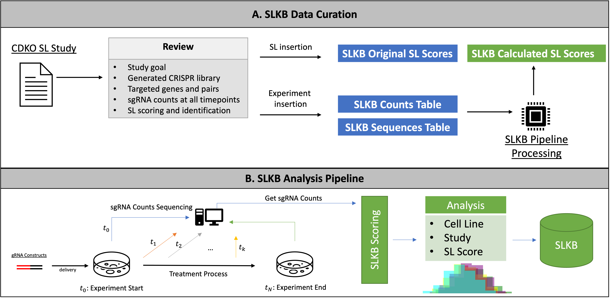
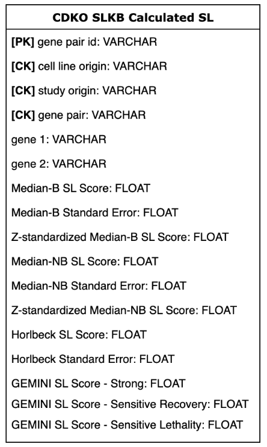

# SLKB Pipeline

## SLKB: Synthetic lethality knowledge base for gene combination double knockout experiments

...

## Database Design

...

## Calculated Scores Table

...

## Interactive Website

Located under its own [page.](website)

...