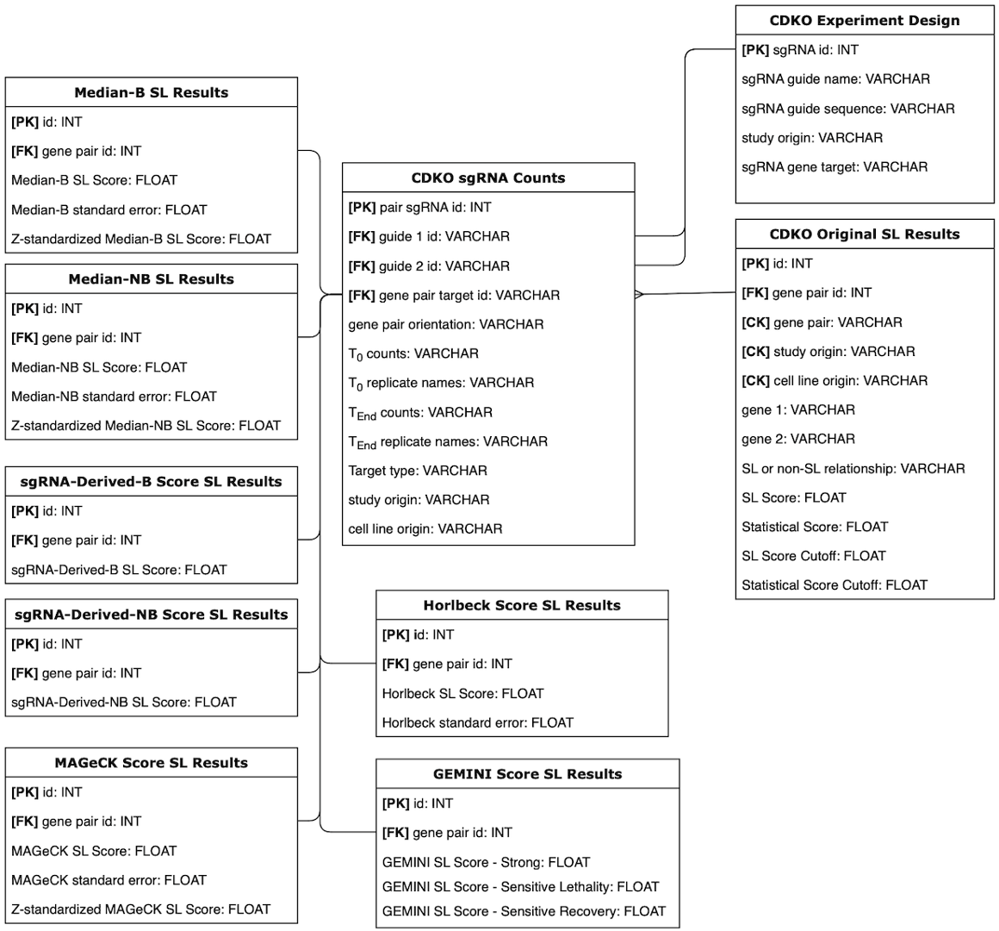

# SLKB Pipeline

## SLKB: Synthetic lethality knowledge base for gene combination double knockout experiments

Synthetic lethality knowledge base (SLKB) is dedicated to curating CRISPR dual knockdown/out experiments (CDKO) aimed to identify synthetic lethal (SL) interactions between two genes. [SLKB pipeline](https://github.com/BirkanGokbag/SLKB-Analysis-Pipeline) supports the following functions:

1) Storing user CDKO experiments under a generalized experimental design

2) Implementing and evaluating different SL scoring methods

3) Enabling data visualization and browsing

4) Support for SL target identification

Following SLKB pipeline, yielding results can be loaded within SLKB web app for full experience.

## Using SLKB

Users can get started through the [shared jupyter notebook file](https://github.com/BirkanGokbag/SLKB-Analysis-Pipeline/blob/main/SLKB/files/pipeline.ipynb). Pipeline with it's full details can be browsed within the [documentation](pipeline.md).

## Database Schema

### Accessible Tables

The schema has the following tables for access:

* cdko_experiment_design
* cdko_original_sl_results
* cdko_sgrna_counts
* horlbeck_score
* median_b_score
* median_nb_score
* sgrna_derived_b_score
* sgrna_derived_nb_score
* gemini_score
* mageck_score

Additionally, two views are available:

* joined_counts: Join of counts table with experiment_design table
* calculated_sl_table: Join of all scoring tables and gene pair information

## Calculated Scores Table

## Interactive Website

Located under the pipeline [subdirectory.](https://github.com/BirkanGokbag/SLKB-Analysis-Pipeline/blob/main/SLKB/files/SLKB_webapp.zip)